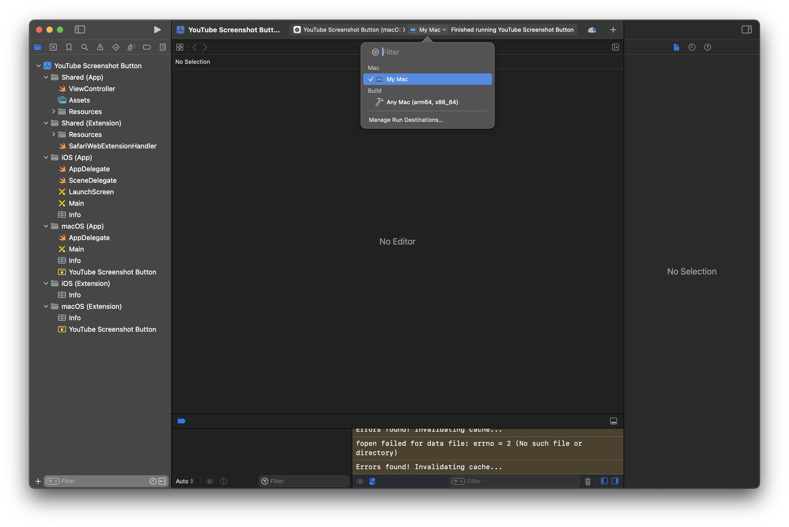

# Chrome to Safari Extension Converter

This application allows you to convert downloaded Chrome extensions into Safari extensions seamlessly.

## Prerequisites

Before you start, ensure you have the following installed:

1. **Python 3.1 or above**: You can download Python from [python.org](https://www.python.org/downloads/).
2. **Xcode 15**: Download and install Xcode from the [Apple Developer website](https://developer.apple.com/xcode/).
3. **Command Line Tools for Xcode**: Install the Command Line Tools by downloading from [here](https://developer.apple.com/xcode/resources/) or by running `xcode-select --install` in the terminal.

## Required Python Packages

The application depends on the following Python packages:

- **Pillow 10.3.0**: An imaging library for Python.
- **tk 0.1.0**: A package for creating graphical user interfaces.

To install these packages, use the following command:

```bash
pip install -r requirements.txt
```

## Usage Instructions

You can run the application using either Method 1 (recommended) or Method 2:

### Method 1

1. Open Terminal in the project directory.
2. Make the run script executable:
    
    ```bash
    chmod +x run.command
    ```
    
3. From now on, you can double-click on `run.command` every time you wish to run the application.

### Method 2

1. Open Terminal in the project directory.
2. Run the application using Python:
    
    ```bash
    python3 main.py
    ```
    

## Using the Application

Once the application is running, follow these steps:

1. **Click the Refresh button**: This will populate the drop-down menu with available Chrome extensions.
    
    
    
2. **Select the Chrome extension**: Choose the Chrome extension you want to convert from the drop-down menu.
3. **Click the Convert button**: The conversion process will start. Wait a few seconds for the process to complete.

### Changing the Scheme

If you need to change the scheme of the extension, follow the instructions in the image below:


### Changing the Destination

To change the destination where the converted Safari extension will be saved, refer to the following image:



### Running the Application

Once you have set everything up, click the **Play** button to start the conversion:


## Configuring Safari

After converting the extension, you need to configure Safari to use the extension:

1. **Open Safari**: Launch Safari on your Mac.
2. **Enable Developer Features**:
    - Go to **Settings** > **Advanced**.
    - Check the box for **Show Develop menu in menu bar**.
    
    
    
3. **Allow Unsigned Extensions**:
    - Go to the **Develop** tab in the menu bar.
    - Select **Allow Unsigned Extensions**.
    
    
    
4. **Enable the Extension**:
    - Go to **Safari** > **Settings** > **Extensions**.
    - Check the boxes for the extensions you want to enable.
    
    
    

### Enabling Unsigned Extensions on Restart

Whenever you restart Safari, you will need to enable **Allow unsigned extensions** again to continue using your converted extensions.

By following these steps, you can easily convert and use Chrome extensions in Safari. Enjoy the expanded functionality!

#License
This project is licensed under the MIT License - see the [LICENSE](LICENSE) file for details.